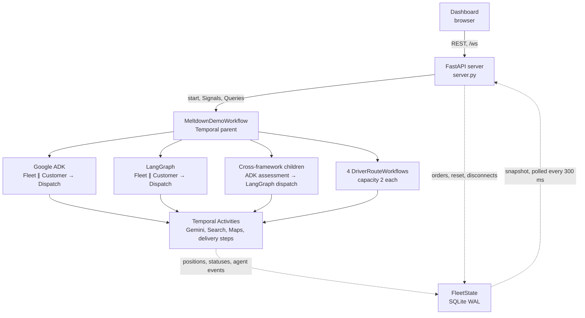

# Ziggy's Durable HITL Agents — Multi-Agent Demo with Google ADK, LangGraph + Temporal 🍦

[](https://google.github.io/adk-docs/)
[](https://docs.temporal.io/develop/python/integrations/langgraph)
[](https://temporal.io/)
[](pyproject.toml)
[](LICENSE)

**A visual Python demo of two durable human-in-the-loop patterns: a human changes
an agent's work, and an agent asks a human for judgment.**

A human is not a function that returns in 200 milliseconds. People answer in
minutes, hours, or not at all, and during that gap the Worker running the agent
gets redeployed, evicted, or crashes. If the pending question lives in process
memory, a restart erases it without an error: the agent forgets it asked, the
order is dropped or handled twice, and model calls you already paid for run
again. We call this **the lost human-in-the-loop wait**. This repo keeps the
wait in Temporal's event history instead: kill the Worker while an agent waits
on a person, answer with no Worker running, restart it, and the answer arrives
as the agent's next step.

<!-- Recapture this screenshot: it predates the dark OpenStreetMap default map (2026-09-30). -->
<p align="center">
  <a href="frontend/img/aie-world-fair-ui-demo-view.png">
    
  </a>
  <br>
  <em>The live fleet, customer orders, and agent reasoning in one view. Select the image for the full-resolution capture.</em>
</p>

**Last verified:** 2026-09-30 — three full 50-order passes on `gemini-3.8-flash`
(Human → Agent, Agent → Human, Cross-Framework), measured in
[Cost to run](#cost-to-run). Those passes ran just before the client-retry
settings in [Retries live in Temporal](#retries-live-in-temporal) were set to
zero; offline tests cover the new settings.

Ziggy's Ice Cream runs a four-driver delivery fleet in downtown San Francisco.
Google ADK and LangGraph own the agent loops. Temporal sits underneath them as
the durable-execution runtime, preserving agent calls, delivery progress, human
waits, and cross-framework handoffs when a Worker disappears.

This repository accompanies the AI Engineer World's Fair talk
[*The Human Is an Async API: Designing Durable Human-in-the-Loop Agents*](aie-world-fair-slides.pdf)
and the Temporal article
[*Durable, flexible multi-agent systems*](https://temporal.io/blog/durable-flexible-multi-agent-systems).

## See the idea in 30 seconds

| Pattern | Who starts it? | What pauses? | What resumes it? |
| --- | --- | --- | --- |
| **Human → Agent** | A customer changes an active order | The driver waits at the venue | A supervisor's approval signal; ADK re-reasons an approved address change |
| **Agent → Human** | A LangGraph agent calls `ask_human` mid-loop | The agent graph and its Temporal Workflow wait | A human answer signal returned as the agent's next observation |
| **Cross-framework** | One order moves from ADK assessment to LangGraph dispatch | Either human interaction can wait durably | The Temporal parent runs the two framework children in sequence and applies the result |

### Dashboard and durable history

<p align="center">
  <a href="frontend/img/aie-world-fair-ziggy-temporal-ui-split-view.png">
    
  </a>
  <br>
  <em>The application view beside its Temporal event history. Select the image for the full-resolution capture.</em>
</p>

### Watch the recorded demo

<p align="center">
  <a href="https://youtu.be/kTPDzsXxKFg">
    
  </a>
  <br>
  <em>▶ <a href="https://youtu.be/kTPDzsXxKFg">Watch the demo</a></em>
</p>

## The boundary that matters

> **Frameworks own the loop—ADK and LangGraph. Temporal is the
> durable-execution runtime beneath them, and in this demo it is what makes
> the handoff between them durable.**

| Layer | Owns |
| --- | --- |
| **Google ADK / LangGraph** | Observe → reason → act, agent abstractions, and tool selection |
| **Temporal** | Workflow state, retries, replay, Signals, durable waits, and child-workflow coordination |
| **FleetState (SQLite)** | A cross-process projection for the dashboard—not orchestration state |
| **Google APIs** | Gemini reasoning, Search grounding, route data, and ETAs |

Temporal does not replace the agent loop. In this demo, LangGraph's checkpointer
is intentionally `InMemorySaver`; Temporal event history is what makes the
suspended work survive a Worker restart. Plain code or A2A could connect the two
frameworks; what Temporal adds is a handoff that survives crashes and retries and
shows up in history.

## Two patterns, three use cases

The dashboard has three tabs. The third combines the first two patterns; it is
not a third HITL pattern.

| Tab | Framework path | Story |
| --- | --- | --- |
| **Human → Agent** | Google ADK | A customer submits a cancel or address change. The driver holds. On approval, the ADK team re-reasons an address change before the driver reroutes. |
| **Agent → Human** | LangGraph | A high-value order usually leads the agent to call `ask_human`. LangGraph interrupts the loop; Temporal preserves the wait; the answer returns to the loop. |
| **Cross-Framework** | ADK child → LangGraph child | ADK assesses, LangGraph dispatches, and the Temporal parent applies the decision to the driver Workflow. Both HITL directions remain available. |

All three use cases share the same operating rule: agent teams **decide**, the
parent Workflow **applies**, and driver Workflows **execute**. On
Cross-Framework the teams run as child Workflows; on the other two tabs they run
inline in the parent.

The multi-agent failure is **the lost handoff**: the specialists finish, the
process dies before their decision is applied, and you re-run them, drop the
order, or apply it twice. On Cross-Framework, the parent's history records each
child's result, so a restarted Worker continues from the next step.

## The durable primitives

Both directions reduce to the same Temporal mechanism: a Signal changes
Workflow state, and `wait_condition` resumes when that state is ready.

### Human → Agent

```python
@workflow.signal
async def update_pending(self, change: OrderUpdateInput) -> None:
    self._pending_holds.setdefault(change.order_id, PendingHold())

await workflow.wait_condition(
    lambda: self._pending_holds[order.order_id].decision is not None or self._stop
)

@workflow.signal
async def resolve_update(self, change: OrderUpdateInput) -> None:
    self._pending_holds[change.order_id].decision = change.change_type
```

The signal begins outside the agent. Approval releases the held delivery; an
approved address change also runs the ADK team again with the new destination.

### Agent → Human

```python
answer = interrupt({"question": question, "order_id": state["order_id"]})

self._pending_dispatch[order_id] = interrupt_payload
await workflow.wait_condition(lambda: order_id in self._dispatch_answers)

answer = self._dispatch_answers.pop(order_id)
result = await graph.ainvoke(Command(resume=answer), config=config)
```

Here the model calls `ask_human`. LangGraph supplies the interrupt/resume
plumbing; Temporal owns the durable wait for the answer Signal.

For the complete implementation path, replay behavior, activity boundaries,
and cross-framework child contracts, read [How it works](HOW_IT_WORKS.md).

## Architecture



Solid arrows are calls: browser requests, Temporal starts, Signals and Queries,
child Workflows, and Activities. Dotted arrows are the dashboard projection:
Activities and the FastAPI server write FleetState (the server for injected
orders, Reset, and driver and agent disconnects), and FastAPI reads it and
pushes changes over `/ws`.
FleetState is not orchestration state; the Workflows keep that in Temporal
history.

The Worker process polls three Task Queues:

- `meltdown-workflows` for orchestration, replay, LangGraph nodes, and small
  projection activities.
- `meltdown-delivery` for navigation, pickup, delivery, and customer changes.
- `meltdown-agents` for ADK model and tool calls, limited to five concurrent
  Activities.

The cross-framework tab makes the handoff explicit:

<p align="center">
  
</p>

### Retries live in Temporal

Every LLM client is set to zero retries (`LLM_MAX_RETRIES = 0` in
`config.py`). A failed model call fails its Activity, and Temporal retries it,
so each attempt shows up in the Temporal UI instead of inside an SDK. The model
Activities (`invoke_model` for ADK, `*_reason` for LangGraph) use Temporal's
default retry policy: unlimited attempts, backoff from 1 s to 100 s, and 60 s
per attempt.

- **LangGraph** (`ChatGoogleGenerativeAI` from `init_chat_model`):
  `max_retries=0`. The library default, 6, made up to six tries inside one
  Activity attempt. The pinned google-genai 1.75.0 treats 0 as one try, and a
  test checks that.
- **ADK:** the Temporal plugin builds ADK's `Gemini` from the model name, so it
  has no constructor knob. Each agent sets `HttpRetryOptions(attempts=1)` in its
  `generate_content_config` instead, and google-genai applies it per request.
  ADK's internal `google_search_agent` has no knob at all. It keeps
  `retry_options=None`, which google-genai also treats as one try.
- **Venue search** (the `google.genai.Client` in `tool_search_venue_events`):
  `attempts=1`. This Activity returns "Event search unavailable" instead of
  raising, so an API error there isn't retried (only a 20 s timeout is), and
  the Customer agent reasons without the search.
- **One resend has no knob.** `uv.lock` installs aiohttp (through
  `google-cloud-aiplatform`), so google-genai 1.75.0 sends async calls through
  aiohttp. That path resends a request once, after a 1–10 s pause, when the
  connection fails (refused, DNS, server disconnect). HTTP errors such as 429
  and 5xx aren't resent. ADK and LangGraph model calls are async and take this
  path; the venue search is sync and doesn't. Temporal doesn't see that resend.

## Run the demo

**No keys yet?** Start with the tests: `make setup && make test` needs no Google
keys and makes no model calls, so it spends no tokens and adds no Google API
charges. It doesn't run the demo; a real demo pass spends 0.73M–1.23M tokens and
$1.44–$1.55 per tab ([Cost to run](#cost-to-run)). The first run downloads
Temporal's test server for the four `driver_route` tests
([Develop and test](#develop-and-test)).

### Prerequisites

- macOS or Linux, Python 3.11 or newer
- [uv](https://docs.astral.sh/uv/)
- [Temporal CLI](https://docs.temporal.io/cli)
- [jq](https://jqlang.org/), only for the optional Maps key check below
- Free ports 7233, 8233, and 8080
- `GOOGLE_API_KEY`, restricted to the Gemini API, on a project with **billing
  turned on**. The default model, `gemini-3.8-flash`, has no Grounding with
  Google Search on the free tier, and the Customer agent grounds every order. A
  pass also makes 300–460 model calls in 10–20 minutes, which free-tier rate
  limits throttle.
- `GOOGLE_MAPS_API_KEY`, restricted to the Directions API, on a project with
  billing. Every truck movement calls it. Google lists the Directions API as
  Legacy, so check that your project can enable it.

Tested on macOS with Python 3.13, uv 0.11.8, and Temporal CLI 1.6.2 (Server
1.30.2, UI 2.45.3). `uv.lock` pins temporalio 1.27.2, google-adk 1.33.0, and
langgraph 1.2.4.

The two Google keys must be separate. **There is no key-free or mock mode:**
the demo makes live Gemini and Maps calls, and the Worker won't start without
both keys. Only the test suite runs without them
([Develop and test](#develop-and-test)). Google now serves `gemini-2.5-flash`
only to accounts that used it before (checked 2026-09-29). To use another
model, set `DEFAULT_MODEL` in `.env`.

### Quickstart

```bash
git clone https://github.com/temporal-community/temporal-ai-hitl-adk-langgraph.git
cd temporal-ai-hitl-adk-langgraph
test -e .env || cp .env.example .env
```

Replace both placeholders in `.env`. Optionally, check the Maps key first. This
prints only the status (needs `jq`); expect `OK`:

```bash
set -a; source .env; set +a
curl -s "https://maps.googleapis.com/maps/api/directions/json?origin=37.7956,-122.3934&destination=37.7841,-122.4017&mode=driving&key=$GOOGLE_MAPS_API_KEY" | jq -r .status
```

Then run:

```bash
./run.sh
```

The script installs the locked dependencies, starts a local Temporal dev
server, starts the three Workers and FastAPI server, waits for readiness, and
shuts down only the processes it created. If only the Worker exits (for example
`make kill-worker`), `run.sh` keeps Temporal and the dashboard running and tells
you how to bring the Worker back. Ctrl-C stops the in-memory dev server, and all
workflow history goes with it.

Expected output (uv's sync output, the Temporal banner, and the server's logs
left out; the Worker's `INFO` lines can interleave differently):

```text
Syncing dependencies with uv...
Cleaning up state...
Starting Temporal dev server...
Waiting for Temporal to be ready...
Starting workers...
Waiting for workers to be ready...
INFO:__main__:Worker mode: LIVE (GOOGLE_MAPS_API_KEY=SET, GOOGLE_API_KEY=SET)
INFO:__main__:Connecting to Temporal at localhost:7233...
INFO:__main__:Starting workers (LIVE MODE)
INFO:__main__:Workers started on queues: meltdown-workflows, meltdown-delivery, meltdown-agents
Starting server...

  App:      http://localhost:8080
  Temporal: http://localhost:8233

Press Ctrl+C to stop.
```

| Interface | URL |
| --- | --- |
| Demo dashboard | <http://localhost:8080> |
| Temporal UI | <http://localhost:8233> |

Create a Gemini key in [Google AI Studio](https://aistudio.google.com/api-keys)
and turn on billing for its project. For Maps, enable the
[Directions API](https://console.cloud.google.com/apis/library/directions-backend.googleapis.com)
and create a separately restricted credential.

### Configuration

Set these in `.env`. `run.sh` and `make worker` load it; the server loads it too.

| Variable | Default | What it does |
| --- | --- | --- |
| `GOOGLE_API_KEY` | none (required) | Gemini calls for every agent |
| `GOOGLE_MAPS_API_KEY` | none (required) | Directions API, for ETAs and truck routes |
| `DEFAULT_MODEL` | `gemini-3.8-flash` | The model every agent uses |
| `GATE_ESCALATION_SECONDS` | `30` | How long an unanswered `ask_human` waits before the backup-approver label. Read once when the Worker starts |
| `MODEL_PROVIDER` | `google_genai` | LangChain provider for the LangGraph agents. Only `google_genai` is installed; another provider needs its LangChain package, and `DEFAULT_MODEL` is also used by the ADK agents |
| `TEMPORAL_ADDRESS` | `localhost:7233` | Temporal frontend address |
| `FLEET_DB_PATH` | `fleet_state.db` in the repo root | SQLite file the dashboard reads |

## Run the story

1. Select a tab and choose **Start Deliveries**. Orders begin at Ziggy's in the
   Ferry Building; four drivers batch up to two orders each.
2. On **Human → Agent**, select an active order and submit an address change or
   cancellation. The driver waits at the venue while a supervisor decides.
3. On **Agent → Human**, choose **Drop high-value order**. The agent usually
   calls `ask_human`, and the approval card appears while the Workflow is
   parked; if no card appears, drop another order.
4. On **Cross-Framework**, inspect the `assess-<order-id>` ADK child and
   `dispatch-<order-id>` LangGraph child in the Temporal UI.

Between runs, click **Reset** (or run `make reset`), wait about 15 seconds,
reload, then **Start Deliveries**. Starting while a run is still open returns
HTTP 500. For timed stage cues and reset instructions, use the
[demo delivery guide](DEMO_GUIDE.md).

### The money moment: kill the Worker while the agent waits

Use two terminals; leave `./run.sh` running in the first.

1. Click **Reset**, open **Agent → Human**, and choose **Start Deliveries**. Let
   two or three orders dispatch.
2. Choose **Drop high-value order** (a $5,400 Moscone Center order). Within a
   few seconds to a minute, a card appears: "Agent called `ask_human`", with the
   question, a line like `order_id order-special-1 · workflow meltdown-demo`,
   and **Approve dispatch** / **Reject**. Asking is the model's call; if no card
   appears, drop another order.
3. In terminal 2, run `make kill-worker`. It sends SIGKILL, so no cleanup runs.
   Within about 10 seconds the header badge reads **Service Offline**, and in the
   Temporal UI `meltdown-demo` is still **Running**. The card can disappear: the
   dashboard reads it through a Query, and Queries need a live Worker.
4. Optional: answer while no Worker exists. Copy the order_id from the card:

   ```bash
   temporal workflow signal --workflow-id meltdown-demo --name answer_dispatch \
     --input '"order-special-1"' --input '"approve"'
   ```

5. Run `make worker`. It replays `meltdown-demo` from history and returns to
   the same wait; if you didn't signal, the card comes back. After more than 30
   seconds (`GATE_ESCALATION_SECONDS`) it also reads "Escalated to backup
   approver (primary window timed out)": the timer fired on the server while no
   Worker was running. For a clean card, set `GATE_ESCALATION_SECONDS=300` in
   `.env` before you start.
6. Choose **Approve dispatch**, unless you signaled in step 4. The agent reasons
   again with your answer as the `ask_human` result. Usually a truck takes the
   order. The agent can still hold it, for example when no driver has a free
   slot; the Dispatch panel then shows it as "held".

Terminal 2 during steps 3 and 5 (some `INFO` lines left out):

```text
$ make kill-worker
worker killed (SIGKILL) — workflow is parked in Temporal
$ make worker
uv run --env-file .env python -m agent_fleet.worker
INFO:__main__:Worker mode: LIVE (GOOGLE_MAPS_API_KEY=SET, GOOGLE_API_KEY=SET)
INFO:__main__:Workers started on queues: meltdown-workflows, meltdown-delivery, meltdown-agents
```

Terminal 1 (`run.sh`) keeps running and prints
`Worker stopped — workflows are parked in Temporal. Bring it back with: make worker`.

**What to watch at <http://localhost:8233>.** Open `meltdown-demo` and its event
history:

- `WorkflowExecutionSignaled` (`answer_dispatch`) appears as soon as you signal
  in step 4, with no Worker running. Temporal stores the Signal; the Worker
  handles it after the restart.
- A `TimerFired` `GATE_ESCALATION_SECONDS` after the agent asked (30 s by
  default), even while no Worker is up: the escalation timer. The parent also
  runs its own 30-second loop timer, so match the time to when the card
  appeared.
- The first `WorkflowTaskStarted` after `make worker` shows a new Worker
  identity (a different `pid@host`).

`make stop-worker` is the graceful version (SIGTERM); the badge flips within
about 3 seconds. Model and tool calls that finished before the kill aren't run
again; their results come from history. A call in flight at the kill runs
again, and is billed again. A Worker you start with `make worker` belongs to
terminal 2; stop it there, or with `make stop-worker`, before a clean restart.

## Videos

| Video | What it shows | One measured pass (`gemini-3.8-flash`, 2026-09-30) | Link |
| --- | --- | --- | --- |
| Conference booth overview | The demo as shown at the conference booth (the video above) | — | [YouTube](https://youtu.be/kTPDzsXxKFg) |
| Temporal & AI Series: Durable Human-in-the-Loop Agents & LangGraph (working title) | An agent asks through `ask_human`; the Worker is killed mid-wait; the answer still lands. A customer change holding a truck is the contrast | Agent → Human: 322 metered calls plus 51 venue searches, 732K tokens, $1.49. Human → Agent: 459 calls, 1.23M tokens, $1.44 | Coming soon |
| Temporal & AI Series: Multi-Agent Handoffs & Google ADK (working title) | One order crosses an ADK child (Fleet, Customer) and a LangGraph child (Dispatch) | Cross-Framework: 400 calls, 839K tokens, $1.55 | Coming soon |

The multi-agent video's money moment: on **Cross-Framework**, drop the
high-value order, wait until `dispatch-order-special-N` is parked on
`ask_human`, then kill the Worker. After the restart and your answer, the order
is dispatched once and the ADK assessment doesn't run again:
`temporal workflow list --query "WorkflowId='assess-order-special-N'"` returns
one execution, and `meltdown-demo` has one `StartChildWorkflowExecutionInitiated`
and one `ChildWorkflowExecutionCompleted` for it.

**As presented.** The last July 2026 showing ran the code tagged
[`as-presented-2026-07`](https://github.com/temporal-community/temporal-ai-hitl-adk-langgraph/tree/as-presented-2026-07).
`main` keeps moving; link the tag when you cite a talk.

## Cost to run

One full pass on `gemini-3.8-flash` (default medium thinking, prices checked
2026-09-29) spends 0.73M–1.23M tokens and $1.44–$1.55 per tab; all three tabs
are 2.80M tokens and $4.48. A Worker restart replays from history and pays again
only for calls in flight. **Reset** and **Start Deliveries**, or a new
`./run.sh` after Ctrl-C, runs the whole pass from scratch and pays for it again.

You pay for Gemini tokens, plus Google Search and Maps Directions requests,
which one pass keeps inside the free allowances. The local Temporal dev server
adds no charge. Waiting on a human makes no model calls and spends no tokens: a
parked `ask_human` is a durable timer plus `wait_condition`.

**Measured** on 2026-09-30 with `scripts/token_usage.py` (the usage Gemini
reported, read from local Temporal history). One full pass per tab: 50
generated orders and a drained queue, plus the injected $5,400 order on Agent →
Human and Cross-Framework. Every card was approved within about 3 seconds, no
Worker was killed, and no model Activity was retried. Model `gemini-3.8-flash`
with its default (medium) thinking. Paid-tier list prices per 1M tokens, checked
2026-09-29 at <https://ai.google.dev/gemini-api/docs/pricing>: $0.75 input,
$0.075 cached, $3.75 output including thinking, through 2026-12-31. From
2027-01-01 it's $1.50 / $7.50, which doubles these dollars.

| Tab | Orders | Gemini calls | Input tokens | Output | Thinking | Total tokens | $ per pass | Per order |
| --- | --- | --- | --- | --- | --- | --- | --- | --- |
| Human → Agent (ADK, inline) | 50 | 459 | 1,050,091 | 53,241 | 121,906 | 1,225,238 | $1.44 | 24.5K tokens, $0.029 |
| Agent → Human (LangGraph, inline) | 51 | 322 + 51 venue searches | 417,549 | 10,257 | 304,450 | 732,256 | $1.49 | 14.4K tokens, $0.029 |
| Cross-Framework (ADK child → LangGraph child) | 51 | 400 | 532,695 | 42,705 | 264,047 | 839,447 | $1.55 | 16.5K tokens, $0.030 |
| **All three tabs** | 152 | 1,181 + 51 venue searches | 2,000,335 | 106,203 | 690,403 | **2,796,941** | **$4.48** | |
| *Comparison:* Human → Agent on `gemini-2.5-flash`, measured 2026-09-29 | 50 | 413 | 740,921 (80,560 cached) | 34,792 | 161,194 | 936,907 | $0.69 | 18.7K tokens, $0.014 |

**Not included:** Google Search fees past the free allowance (3.x models: 5,000
queries a month free per paid key, then $14 per 1,000; the passes made 47, 51,
and 40 grounded prompts), the tokens of the 51 LangGraph venue searches (each is
a grounded Gemini call, so Agent → Human made 373 Gemini calls in all;
LangGraph doesn't keep their tokens in history, and they aren't estimated
here), and Maps Directions requests
(151 to 175 a pass, inside the 10,000 a month free per billing account, then $5
per 1,000).

**What changes it:**

- **Thinking tokens.** Output and thinking were about two-thirds of the
  measured dollars; on LangGraph, thinking is 304K of 315K output-side tokens.
- **Model.** The Human → Agent tab went from $0.69 a pass on 2.5 Flash to $1.44
  on 3.8 Flash.
- **Run length.** The fleet-status tool lists every order so far, so order #50's
  prompt is 2–3× order #1's. Measure a full pass rather than multiplying an
  early per-order figure.
- **Retries.** A call in flight when you kill the Worker runs again and is
  billed again. Rejected 429s aren't billed, but they slow the run. Apart
  from google-genai's one resend after a connection failure, every model
  retry is a Temporal Activity attempt
  ([Retries live in Temporal](#retries-live-in-temporal)), so
  `scripts/token_usage.py` counts the extra attempts but can't price them:
  history keeps only the last attempt's result.

**Measure it yourself** before you press Ctrl-C on `./run.sh`, because the dev
server keeps history in memory. The script reads local history through the
`temporal` CLI and makes no API calls:

```bash
uv run python scripts/token_usage.py                                  # every matching run on localhost:7233
uv run python scripts/token_usage.py --run-id <meltdown-demo run ID>  # one pass and its children
```

Every Reset and Start reuses the same workflow IDs, so pick one pass with
`--run-id` or `--since HH:MM`. The Google AI Studio usage page and your Cloud
Billing report are the final word.

## What this is not

- **Not an approval system.** The approve endpoints on localhost:8080 have no
  authentication, approver identity, or notification. The "backup approver" is
  a label that appears after a 30-second durable timer; nobody else is
  contacted. Approvals are Signals, so the UI reports success when Temporal
  accepts the Signal, not when the Workflow applies it.
- **Not a policy enforced in code.** Whether to call `ask_human` is the model's
  judgment, steered by prompt text (`ESCALATION_GUIDANCE` in
  `langgraph_agents.py`). The model may ask zero, one, or two times. A real
  system should back this with a hard limit in code.
- **Not LangGraph checkpointer durability.** The graph compiles with
  `InMemorySaver`. Temporal's history and replay are what survive the crash.
- **Not exactly-once.** A model or tool call in flight during a crash runs
  again. Tools with side effects need idempotency.
- **Not sized for long runs.** Model inputs and outputs are stored in history.
  In the measured passes, `meltdown-demo` ended at about 9.4 MB (4,947 events)
  on Human → Agent, just under Temporal's 10 MB warning, and at about 7.3 MB
  (4,402 events) on Agent → Human; on Cross-Framework the parent stayed at about
  0.4 MB because the model calls run in child Workflows. The continue-as-new
  guards on the parent and the drivers count events (10,000), not bytes, and
  they don't fire in a normal pass. On a longer run the size warning comes
  first.
- **Not a routing system or production-hardened.** Trucks move along Maps
  routes in a SQLite-backed simulation. The client connects with
  `TEMPORAL_ADDRESS` only (no namespace, API key, or TLS), so as written it
  can't reach Temporal Cloud. The Temporal LangGraph and Google ADK
  integrations are marked experimental in the SDK.

## How other tools handle the human wait

| Tool | How an agent pauses for a person | What keeps the wait durable | A good fit when... |
| --- | --- | --- | --- |
| LangGraph + Postgres checkpointer | `interrupt()` in a node; resume with `Command(resume=...)` on the same `thread_id` | `PostgresSaver` stores the graph state; your app decides when to resume | There's one graph, one pause, and you already run Postgres |
| OpenAI Agents SDK | Tools marked `needs_approval` stop the run; approve or reject on the `RunState`, then call `Runner.run(agent, state)` | Your app stores the serialized `RunState` | A web app already owns storage and resume endpoints |
| Google ADK | Long-running function tools and tool confirmation (`require_confirmation`, experimental); resume with a function response to the confirmation call. ADK's docs also ask for the same `invocation_id` when Resume is on (checked 2026-10-01) | The session service. ADK's docs list `DatabaseSessionService` and `VertexAiSessionService` as not supported for tool confirmation (checked 2026-10-01) | One ADK app with a short pause inside a session |
| Pydantic AI | Deferred tools (`requires_approval` / `CallDeferred`) end the run with `DeferredToolRequests`; resume with `DeferredToolResults` | Wherever you store the message history (integrations exist for Temporal, DBOS, and Prefect) | You want framework-native approvals on your own storage |
| Microsoft Agent Framework | Workflows raise request/response pairs (`RequestPort`, `request_info`); checkpoints include pending requests | A checkpoint store; the Durable Task extension waits for external events, with timeouts | Your team is standardized on Azure |
| A2A protocol | A task enters `input-required`; the client continues the same task | Each agent's own implementation; the protocol defines the task states | You're connecting agents across vendors or frameworks (pair it with a durable-execution runtime) |
| This repo (Temporal) | `ask_human` → LangGraph `interrupt()` → `workflow.wait_condition` until a Signal arrives | Temporal event history; any Worker can resume after replay, and the escalation timer survives a crash | You have many waits, timers, crash recovery, or handoffs across frameworks. The cost is running a Temporal server and Workers and following determinism rules |

Sources, checked 2026-09-29 (ADK row rechecked 2026-10-01):
[LangGraph interrupts](https://docs.langchain.com/oss/python/langgraph/interrupts) ·
[OpenAI Agents SDK HITL](https://openai.github.io/openai-agents-python/human_in_the_loop/) ·
[ADK tool confirmation](https://adk.dev/tools-custom/confirmation/) ·
[Pydantic AI deferred tools](https://pydantic.dev/docs/ai/tools-toolsets/deferred-tools/) ·
[Agent Framework HITL](https://learn.microsoft.com/en-us/agent-framework/workflows/human-in-the-loop) ·
[Durable Task extension](https://learn.microsoft.com/en-us/agent-framework/integrations/durable-extension) ·
[A2A specification](https://a2a-protocol.org/latest/specification/) ·
[Temporal LangGraph HITL](https://docs.temporal.io/develop/python/integrations/langgraph#human-in-the-loop)

## Troubleshooting

| You see | Cause | Fix |
| --- | --- | --- |
| `Error: uv is required.` or `Error: temporal is required.` | The tool isn't on your `PATH` | Install [uv](https://docs.astral.sh/uv/) or the [Temporal CLI](https://docs.temporal.io/cli) |
| `RuntimeError: Missing required environment variables: GOOGLE_API_KEY ...`, then `Error: worker process exited during startup.` | `.env` is missing, a key is still a `your-...` placeholder, or the Worker was started without `--env-file` | `cp .env.example .env`, set both keys, then use `./run.sh` or `make worker` |
| `Error: workers were not ready after 10 seconds.` | The Worker is running but hasn't written its heartbeat file yet. It writes it only after it connects to Temporal and creates its Workers, in the folder that holds `FLEET_DB_PATH` | Rerun `./run.sh`. If it repeats, check that the `FLEET_DB_PATH` folder (the repo root by default) is writable |
| `Error: Temporal dev server exited before becoming ready.` or `Temporal dev server exited unexpectedly; stopping the demo.` | Ports 7233 or 8233 are taken, often by another Temporal dev server | Stop the other server, then rerun `./run.sh` |
| `Error: Temporal dev server was not ready after 30 seconds.` | The dev server is still running but didn't report `SERVING` to `temporal operator cluster health` within 30 seconds, for example on a slow first start | Rerun `./run.sh`. If it repeats, read the dev server's output above the error |
| `Server exited unexpectedly; stopping the demo.` | The FastAPI server died, often because port 8080 is taken | Free port 8080, then rerun `./run.sh` |
| `Worker stopped — workflows are parked in Temporal. Bring it back with: make worker` | The Worker exited: `make kill-worker`, `make stop-worker`, or a crash | Expected during the demo. Run `make worker` |
| `Maps Directions API returned status: REQUEST_DENIED` in the Temporal UI | The Directions API isn't enabled on the key's project, or the key is restricted to other APIs | Enable the Directions API, restrict the key to it, and rerun the preflight `curl` |
| `Maps Directions API HTTP <code>` in the Temporal UI or Worker log | Google Maps answered with a non-2xx status. The message leaves out the URL on purpose, because the key is in it | 4xx: check the key, its API restriction, and billing. 5xx: transient; Temporal retries it |
| `Maps Directions API request failed: <ErrorType>` (for example `ConnectTimeout`) | The request to Maps timed out or couldn't connect | Check your network. Temporal retries it |
| `429 RESOURCE_EXHAUSTED` on `invoke_model` or `*_reason` (attempt > 1 in the Temporal UI) | Gemini rate limits, common on free-tier keys | Use a key with billing turned on |
| `API key not valid. Please pass a valid API key.` (`API_KEY_INVALID`) | Wrong Gemini key | Copy the key again from AI Studio |
| Start Deliveries fails with HTTP 500; the server log shows `WorkflowAlreadyStartedError` | A `meltdown-demo` run is still open | Click **Reset**, wait about 15 seconds, reload, then Start |
| An order never dispatches, and the Temporal UI shows `WorkflowTaskFailed` on `assess-<order-id>` (Cross-Framework) or on `meltdown-demo` (Human → Agent, where the whole run stalls) | An exception inside the ADK agent loop. The loop runs in Workflow code with nothing catching it (`runner.run_async` in `workflows.py`), so Temporal fails the Workflow Task and retries it instead of failing the Workflow | Click **Reset**. To find a stuck run, use `temporal workflow list --query "TemporalReportedProblems IN ('category=WorkflowTaskFailed')"`, then open it in the Temporal UI to read the error |
| `Escalated to backup approver (primary window timed out)` | The approval timer (`GATE_ESCALATION_SECONDS`, default 30) fired | Expected. Set a longer window in `.env` if you want one |

The Worker quiets `httpx` request logging so Maps URLs, which carry the key,
stay out of the log. Older versions of this repo logged them; if you shared or
recorded Worker output from one, rotate the Maps key.

## Develop and test

```bash
make setup
make lint
make test
```

The test suite runs without Google keys and covers activity behavior, the
SQLite projection, API request contracts, Worker startup validation, Temporal
Signals and waits, per-order holds, cancellation races, driver continue-as-new
(an integration test) and the parent's continue-as-new decision (unit tests),
and the zero-retry LLM client settings. The four `driver_route` tests download
Temporal's test server on first run; use `uv run pytest -k "not driver_route"`
offline.

### Make targets

Each target wraps one command, shown next to it. Run `reset`, `failure`, and
`recovery` from a second terminal while `./run.sh` runs in the first.

| Target | Raw command | What it does |
| --- | --- | --- |
| `make setup` | `uv sync --all-extras --frozen` | Installs exactly what `uv.lock` pins, as `run.sh` does |
| `make install` | `uv sync --all-extras` | Same, but uv may update `uv.lock` |
| `make run` | `./run.sh` | Starts Temporal, the Worker, and the dashboard, always from a clean state |
| `make reset` | `curl -fsS -X POST http://localhost:8080/api/reset` | Same as the **Reset** button: terminates the demo Workflows and clears FleetState. The app must be running |
| `make failure` or `make kill-worker` | `pkill -9 -f "[a]gent_fleet.worker"` | Crashes the Worker (SIGKILL); Temporal and the dashboard keep running |
| `make recovery` or `make worker` | `uv run --env-file .env python -m agent_fleet.worker` | Starts a Worker with `.env`; it replays open Workflows from history |
| `make stop-worker` | `pkill -f "[a]gent_fleet.worker"` | Graceful stop (SIGTERM); the badge flips within about 3 s |
| `make lint` | `uv run ruff check . && uv run ruff format --check .` | Lint and format check |
| `make fmt` | `uv run ruff check --fix . && uv run ruff format .` | Fix lint and format |
| `make test` | `uv run pytest` | Runs the full test suite |

## Repository map

| Path | Role |
| --- | --- |
| `agent_fleet/workflows.py` | Parent, driver, order-generation, and cross-framework child Workflows |
| `agent_fleet/agents.py` | Google ADK Fleet, Customer, and Dispatch team |
| `agent_fleet/langgraph_agents.py` | LangGraph team, tools, `ask_human`, and graph routing |
| `agent_fleet/activities.py` | Delivery, Maps, Search, and agent-tool Activities |
| `agent_fleet/_activity_tool.py` | Wrapper that exposes Activities as ADK tools; a tool that runs out of retries returns an error string to the agent |
| `agent_fleet/worker.py` | Three Task Queue Workers and plugin registration |
| `agent_fleet/server.py` | Signal/query API, WebSocket feed, and frontend hosting |
| `agent_fleet/simulation.py` | SQLite-backed dashboard projection |
| `agent_fleet/config.py` | Environment settings, defaults, and `LLM_MAX_RETRIES = 0` |
| `agent_fleet/models.py` | Workflow and Activity inputs, outputs, and status enums |
| `agent_fleet/queues.py` | The three Task Queue names |
| `agent_fleet/locations.py` | Ziggy's, the San Francisco venues, and the reroute choices |
| `frontend/` | Single-page fleet dashboard and visual assets |
| `scripts/token_usage.py` | Tokens and dollars per pass, read from local Temporal history |
| `tests/` | Test suite; runs without Google keys ([Develop and test](#develop-and-test)) |
| `run.sh` | Starts Temporal, the Worker, and the server, and stops only what it started |
| `Makefile` | Setup, run, reset, failure/recovery, lint, and test targets ([Make targets](#make-targets)) |
| `.env.example` | Template for `.env`: the two keys plus optional settings |
| `pyproject.toml`, `uv.lock` | Dependencies and the locked versions `make setup` installs |
| `HOW_IT_WORKS.md` | Detailed architecture and execution mechanics |
| `DEMO_GUIDE.md` | Talk track, demo flow, recovery beat, and reset steps |
| `AGENTS.md` | Instructions for coding agents: how to run and test, and the conventions to keep |
| `aie-world-fair-slides.pdf` | Slides from the AI Engineer World's Fair talk |

## Next step

Run one pass on **Agent → Human**, kill the Worker while the card is up, bring
it back, and measure the pass with `scripts/token_usage.py`. Measured
2026-09-30 on the default `gemini-3.8-flash`: that tab is 322 metered Gemini
calls plus 51 venue searches, 0.73M tokens, and $1.49 a pass; all three tabs
together are 1,181 metered calls plus those 51 searches, 2.80M tokens, and
$4.48. Search fees, LangGraph venue-search tokens, and Maps are extra
([Cost to run](#cost-to-run)).

## Resources

- Temporal Python SDK docs:
  [LangGraph integration](https://docs.temporal.io/develop/python/integrations/langgraph)
  and [Google ADK integration](https://docs.temporal.io/develop/python/integrations/google-adk)
  (the ADK page describes temporalio 1.28.0 or later; this repo locks 1.27.2)
- [How it works](HOW_IT_WORKS.md): execution path, replay, Activity
  boundaries, and the cross-framework child contracts
- [Demo delivery guide](DEMO_GUIDE.md): stage cues, the recovery beat, and
  reset steps
- [Conference booth video](https://youtu.be/kTPDzsXxKFg); the Temporal & AI
  Series videos are listed under [Videos](#videos)
- [*Durable, flexible multi-agent systems*](https://temporal.io/blog/durable-flexible-multi-agent-systems)
  on the Temporal blog
- [*The Human Is an Async API*](aie-world-fair-slides.pdf): slides from the AI
  Engineer World's Fair talk
- [`as-presented-2026-07`](https://github.com/temporal-community/temporal-ai-hitl-adk-langgraph/tree/as-presented-2026-07):
  the code as shown in July 2026

## Acknowledgements

This demo was a team effort. With thanks to:

- [Alfred Chan](https://www.linkedin.com/in/alfredschan/) — visual design and UI assets.
- [Tim Conley](https://www.linkedin.com/in/tim-conley-0b249b14/) — Google ADK integration and review.
- [David Hyde](https://www.linkedin.com/in/dabh/) — LangGraph integration and review.
- [Maple Xu](https://www.linkedin.com/in/maple-xu/) — ADK event-history summaries.
- [Angie Byron](https://www.linkedin.com/in/webchick/) — documentation and review.
- [Josh Geller](https://www.linkedin.com/in/joshua-geller-913311191/) — video editing.
- [Cecil Phillip](https://www.linkedin.com/in/cecilphillip/) — ideation and review.

Adapted from the original **Meltdown** ice-cream delivery fleet demo.

## License

[MIT](LICENSE)
